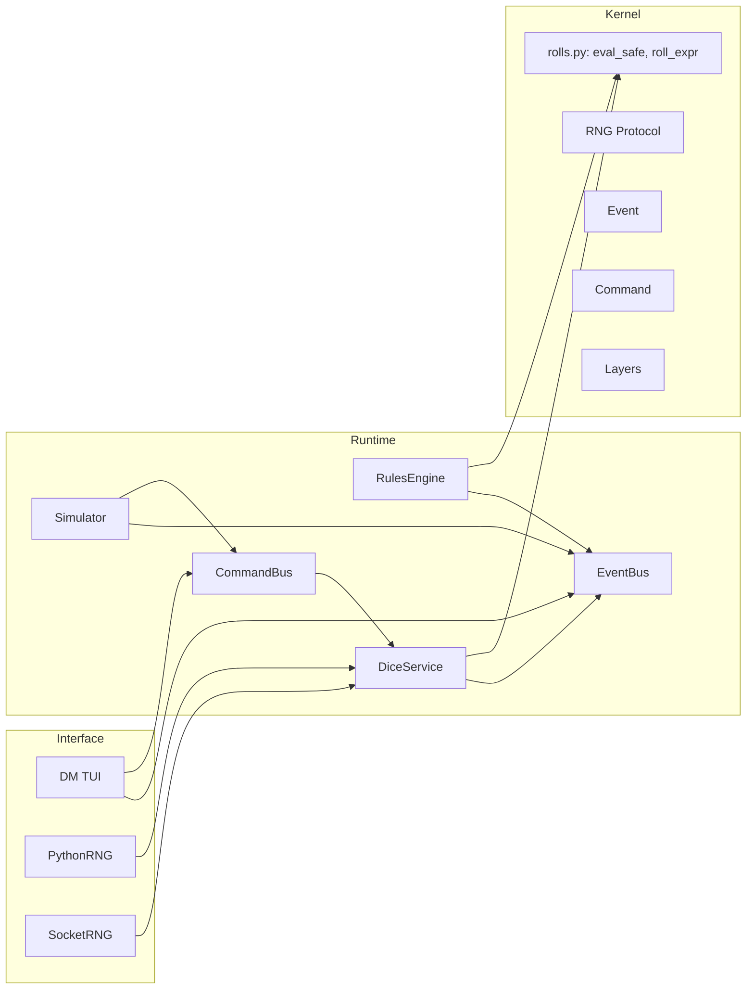

# baator-world Architecture v0.4

## Layer Diagram

### Kernel
The diagram below shows the flow of events through the layers of the architecture. The Kernel provides two simple interfaces for the runtime to use: `eval_safe()`, which will parse an expression like `1d6+2 + actor.stats.STR` into an AST of two nodes: `1d6+2`, and `actor.stats.STR`. These can both be passed to `roll_expr()` to return a value: in the first case, the concrete instance of `1d6+2`, an integer between 3 and 8; and `actor.stats.STR`, which will return the current STR stat of the actor who is rolling.



The kernel additionally provides some abstractions for interacting with it. Its random number behaviour can be influenced by providing any Python class that that fulfills the behaviour contract. The `RNG` protocol is defined as follows:

```python
class RNG(Protocol):
    """Protocol for RNG providers used throughout the Baator engine."""

    def ping(self) -> bool:
        """Optional health check."""
        ...

    def random_int(self, low: int, high: int) -> int:
        """Return an integer in [low, high], inclusive."""
        ...

    def roll(self, sides: int) -> int:
        """Roll a die with the given number of sides, returning a value in [1, sides]."""
        ...
```

As such, you can provide both a generic Python RNG provider, as in `PythonRNG`, or can interface with a custom one, such as `SocketRNG`, which will communicate with the C++ RNG provided in `tools/rngd/rngd.cpp` over a TCP socket. The `dm_tui` program uses the environment variable `BAATOR_RNG=["socket|python"]` (defaulting to `python`) to determine which of these to use. Please feel free to write your own generators of tilted odds and Universal entropy manipulation! ⚡️😈

### Runtime
As the kernel provides only the very minimal interface of providing exact dice roll results, the runtime provides a much cleaner abstraction for interacting with it. The runtime is a basic CQRS architecture: commands are published to the event bus, the responding service will subscribe to that command, and publish its results back to the event bus. Currently this is all done in-process, but adapters have been provided to do this over an MQ like RabbitMQ.

#### DiceService
`DiceService` provides the following runtime API:

```python
def roll_expression(self, expr: str, *, ctx: Optional[Mapping[str, Any]] = None, meta=None) -> int: ...

def handle(self, cmd: Command) -> None: ...
```

The `roll_expression()` method is the primary purpose here; it will accept any valid expression like `(n[dD]s+/-m[k[h?|l]d]|[\d+]|[A-Za-z0-9_-.])`. In other words, it will accept a sequence of: either a dice expression (detailed below), any numeric literal, or a variable name. In the case of the variable name, a value taken from `ctx: Dict[str, Any]` will replace the text with the same key. For example, `actor.stats.STR` would be replaced with the value of `ctx["actor"]["stats"]["STR"]`.

The `handle()` method is provided so that the command bus can interact with it. For example, the TUI may request the command `dice.roll_expr` (to which `DiceService` is listening), and then the command will be invoked by the service itself and the result returned via the event bus.

##### Dice Expressions
The regular expression provided above is a bit terse, so the rules can be expressed more clearly like:
* a basic d20 roll expression like `4d6` (expressed `n[dD]s`, optionally modified by an integer expression `+/- m`.
* this roll can be modified with `k[h?|l]d` (keep mode: "h" (default) - keep highest `d`; or "l" keep lowest `d`. The simplest application of this would be the advantage/disadvantage mechanic: `2d20kh1`, or simply, `2d20k1` (advantage); `2d20kl1`, disadvantage. Character stat rolling often has this usage too: `4d6kh3`.
* Any of the values required above (such as `m`) can be provided with a variable expression, which will be evaluated to a concrete number prior to its being used (e.g. `actor.stats.STR`)

#### EventBus
This is a simple publish/subscribe interface to a message queue. In v0.4, the queue is implemented in-process, but adapters exist to extend this to RabbitMQ for later versions.

#### CommandBus
Similar to the `EventBus`, the `CommandBus` provides a mechanism for the appropriate service method to be called from an UI. The UI will send `Commands` to the `CommandBus`, to which services are subscribed. A service that processes the command will return the result of the command back to the `EventBus` in the form of an `Event`.

#### RulesEngine
In addition to context, the meaning of a dice roll is influenced by rules. These rules are applied by the rule engine. So, for example, a `physical.basic.attack` rule could be invoked by the UI to resolve an encounter (here called `Scenes`) between `Participants`. The rule in question is defined as follows for v0.4:

```yaml
rules:
  - id: attack.basic
    layer: physical
    when: ["target.hp > 0"]
    roll: "1d20+actor.stats.STR"
    dc: "target.AC"                 # dynamic DC
    on_success:
      - type: command
        name: "physical.take_damage"
        payload: { amount: "1d8+actor.stats.STR", layer: "physical" }
    on_failure:
      - type: event
        name: "physical.attack_missed"
        payload: {}
```

So, the UI would request application of this rule to the rules engine, and provide the context:

```python
ctx = {
  actor: { stats: physical: { STR: 12 } }
  target: { stats: physical: { AC: 12 } }
}
```

The rule engine, seeing that this rule requires a roll of 1d20+STR vs. the target's AC (a pretty standard d20 mechanic) will first parse the roll expression into its AST components: `1d20` and `actor.stats.STR`, and the parent node, the addition combining the two of them. The result, an integer, is compared to the DC (processed exactly the same way). On success, the command `physical.take_damage`, with the concrete payload specified, will be sent to the `CommandBus`.

#### Simulator
Tying this all together is the `Simulator`, which will tick through `Scenes`, invoke the `RulesEngine` as necessary to resolve them. And then the `Simulator` is controlled through a user interface, such as the `dm_tui` provided here.

---

### Simulator Sequence Summary

```mermaid
sequenceDiagram
  participant T as TUI
  participant S as Simulator
  participant R as RulesEngine
  participant K as Kernel.rolls
  participant E as EventBus
  participant C as CommandBus

  T->>S: apply_rule(scene, rule_key, actor, target, ctx_extra)
  S->>E: sim.trace.begin
  S->>R: apply(rule, ctx, provenance)
  R->>K: roll_expr(rule.cost?)
  R->>K: roll_expr(rule.dc)
  R->>K: roll_expr(rule.roll)
  R->>E: rules.trace {roll, dc, success}
  R-->>S: {applied, success, roll, dc}
  S->>C: dispatch command(s) on success
  C-->>(facets/services): handle side-effects
  S->>E: sim.trace.end {success, roll}
```

